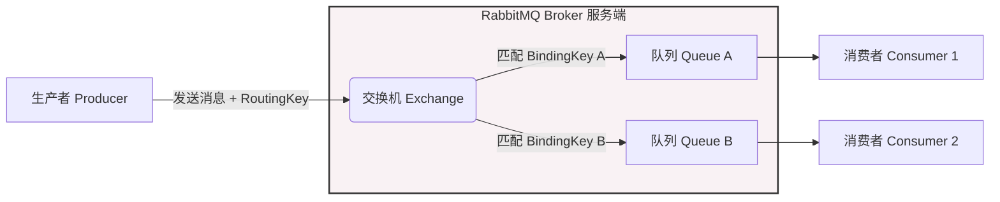

## 1. 核心组件与概念
- **Broker**: 消息中间件的服务端实例节点，负责接收、存储和分发消息。
- **Queue（队列）**: RabbitMQ 中的基本存储单元，用于暂存数据，实现生产者和消费者之间的解耦，以及流量高峰时的削峰填谷。
  - 原生支持多种高级特性，如延时队列、死信队列和优先级队列。
  - **优先级队列**：允许消费者根据消息的优先级进行消费，在 GPU 等资源紧俏的 AI 服务调度场景中非常实用。
- **Exchange（交换机）**: 路由分发组件。它不存储消息，而是根据消息的 `RoutingKey` 与队列绑定的 `BindingKey` 的匹配规则，将消息路由到一个或多个 Queue。

## 2. 集群与高可用模式
为了提高性能和可用性，RabbitMQ 可以通过多节点构成集群：
- **普通集群模式（Default）**: 节点间仅同步元数据（如队列结构、交换机属性）。队列的实际数据只存在于单个节点上。
  - *特点*：无法实现读写分离，单个队列的吞吐量受限于单台机器性能，存在单点故障问题。
- **镜像队列模式（Mirroring）**: 主节点会将队列数据同步到从节点，实现高可用。
  - *特点*：牺牲了一定的吞吐量来换取数据安全；在网络波动时容易出现"脑裂"（Split-Brain）问题（即多个节点互相隔离，都认为自己是新的主节点）。
- **Quorum 队列模式（仲裁队列）**: 新一代高可用队列。
  - *特点*：引入了 Raft 分布式一致性算法来同步多个 Broker 间的队列和元数据。通过多数派选举产生主节点，从根本上解决了脑裂问题。

## 3. 核心架构与消息流转图

## 4. 问题：功能相似，为什么 RocketMQ 快那么多？
虽然两者都是优秀的消息队列，但底层设计哲学不同，RocketMQ 的吞吐量远高于 RabbitMQ，主要原因如下：

- **底层存储与 I/O 模型不同（核心差异）**
  - RocketMQ：采用**顺序写盘 + 零拷贝（mmap/sendfile）**技术。所有主题的消息全部追加写入同一个物理文件（CommitLog），磁盘的顺序写速度几乎可以媲美内存。
  - RabbitMQ：每个队列都有独立的存储文件。当队列数量增多、并发量大时，磁盘 I/O 会从顺序写退化为**随机写**，导致性能急剧下降。
- **架构复杂度与路由开销**
  - RabbitMQ：实现了极其复杂的 AMQP 协议，Exchange 的路由规则（如 Topic 模式下的正则匹配）非常灵活，但在海量数据下会消耗大量 CPU 资源。
  - RocketMQ：路由模型更简单（仅通过 Topic 和 Tag 过滤），省去了复杂的计算开销，专注于极高并发下的数据吞吐。
- **海量消息堆积能力**
  - RabbitMQ：设计初衷是让消息"快速流动"。一旦发生大量消息堆积，会导致内存占用飙升并触发流控（阻塞生产者），吞吐量会出现断崖式下跌。
  - RocketMQ：天生为海量消息堆积设计。消息直接落盘存储，即使堆积亿级消息，其性能也不会受到明显影响。
- **开发语言与并发模型**
  - RabbitMQ：使用 Erlang 开发，优势在于微秒级的超低延迟和网络并发管理，但文件 I/O 并非其强项。
  - RocketMQ：使用 Java 开发，在底层深度压榨了操作系统的文件系统性能，专为互联网级的高吞吐业务打造。
